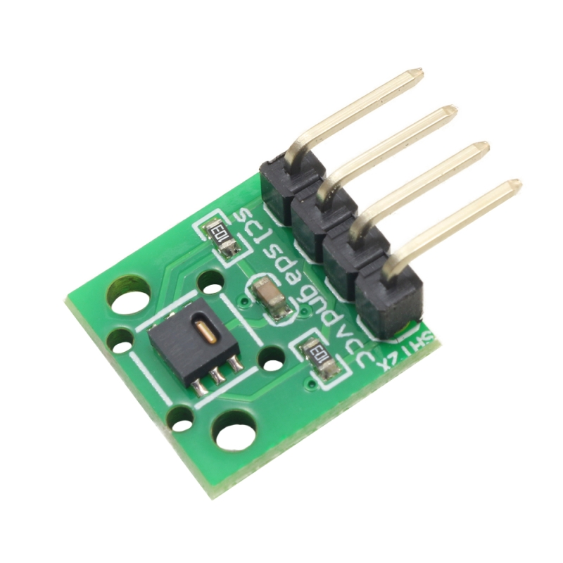
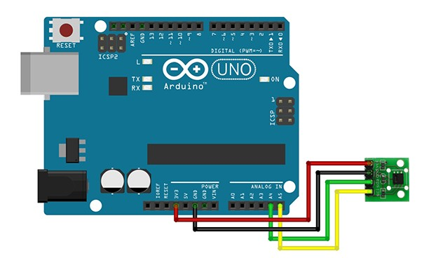
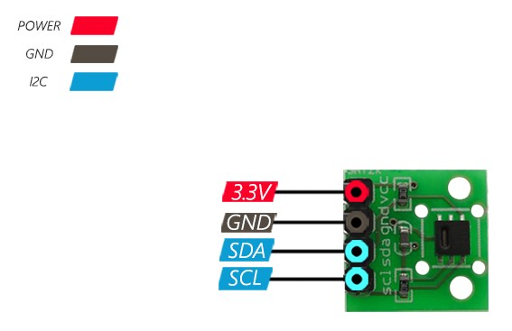

# **🧠🌐 Project: Temperature and humidity control using Arduino Uno board using machine learning algorithm combining artificial intelligence and Internet of Things (AI-IoT)**

Sending data to a computer (via USB cable) and drawing graphs in Python, creating datasets from sensors for machine learning

## **Starting AI-IoT project**

### **✅ Step 1: Collect and send real data from Arduino to computer**
- We send temperature and humidity data to the computer via USB(Serial).
- We store, analyze, and visualize this data in Python.

### **✅ Step 2: Create a custom dataset for the AI ​​model**
- We save the recorded data in a CSV file.
- For example, columns include: time, temperature, humidity, label (e.g. fan on/off)

### **✅ Step 3: Intelligent Modeling in Python with Scikit-Learn**
- Simple Machine Learning Model (e.g. Classification or Regression)
- Intelligent Decision Making: For example, model predicts when to turn on the fan

### **✅ Step 4: Send smart command to Arduino**
- If the temperature gets too high, or the AI ​​algorithm decides, a command to turn on the fan or siren is sent to Arduino.

## **Project preparations**

### Arduino Pinout Diagram:

### **🧠 Brief theoretical explanation of the project components:**

**📌 SHT20 Sensor**
- Communication Protocol: I2C
- Default Address: 0x40
- Accuracy: Temperature ±0.3°C, Humidity ±2%
- Very suitable for precision environmental projects

**📌 I2C communication**
- Uses two wires: SDA (data) and SCL (clock)
- On Arduino: pins A4 and A5 (SDA/SCL)

SHT20 ---- Arduino
 VCC    →     5V
 GND    →     GND
 SDA    →     A4
 SCL    →     A5

|  SHT20  | Arduino 
|   ----  |  ----  |
|  VCC    |  5V    |
|  GND    |  GND   |
|  SDA    |  A4    |
|  SCL    |  A5    |

**Installing the library:**
- SHTSensor
- Wire

## **🛠 Project start and preparation**
We want to connect Python to Arduino via USB port and display and save data coming from Arduino in real-time. So we need to find the correct COM port.
- First, we connect the Arduino Uno board to the system.
- Then, in the "Device Manager" section, you can see which COM port is assigned to it.

## **✅ Project Pase 1: Receive serial data from Arduino and save to CSV with Python**
**🎯 Target:**
- Communicate Python with Arduino via USB port
- Read temperature and humidity data
- Save data to CSV file
- Display online in console

### **🧱 Step 1: Arduino code (simplified) for measuring temperature and humidity using a sensor SHT20**
The code for this step is located in the path: *→ Sending_Arduino_Temp_Humid_to_Serial → src → main.cpp* .

### **🐍 Step 2: Python code to receive and store data sent from Arduino**
#### **📦 First install the library:**
In the VS Code terminal, type:

pip install pyserial pandas

#### **💾 Then run this Python script in  file: ** 
*Receive_and_store_sensor_data.py*

### **🔍 Result:**
- Data is displayed instantly
- Pressing Ctrl + C stops the download and creates a CSV file

We now have a CSV file containing:

Timestamp, Temperature, Humidity
2025-06-03 22:01:00, 30.17, 31.64
...

## **✅ Project Pase 2: Plotting temperature and humidity graphs with Python**
### **📌 Tools:**
- pandas to read CSV file
- matplotlib to plot graphs
### **🐍 Python code for plotting the graph**
The code for this section is in a *file called plot_sensor_data.py*
### **📦 Install matplotlib:**
Type this code in the terminal:
pip install matplotlib

### **🔍 Result:**
- A beautiful and accurate graph of the temperature and humidity change trend
- Check what patterns are in the data (to prepare the machine learning model)

## **🧠 Project Pase 3: Build a machine learning (ML) model for prediction or intelligent decision-making**
I built a model that decides whether to turn on the fan (or a similar control output) based on temperature and humidity data.

### **🔍 Simple Scenario: Fan Control Based on Environmental Conditions**
**Model Input:**
- Temperature
- Humidity

**Model Output:**
- 1 → Fan should be turned on
- 0 → Fan should be turned off

### **✅ Step 1: Labeling**
I added a new column to the CSV that tells each row whether the fan should be turned on or not.

For example:
| Temp | Hum  | Fan |
| ---- | ---- | --- |
| 28.5 | 40.1 | 0   |
| 32.0 | 38.5 | 1   |
| 29.8 | 65.2 | 1   |

#### **📌 Simple way to test:**
We can say:
1. If Temp > 30 or Humidity > 60 → Fan on (1)
2. Otherwise → Off (0)

#### **🐍 Python code for data preparation:**
This code was placed in the file *Labeling_sensor_DataCSV.py* and the result was saved in a new CSV file called *labeled_data.csv* .

### **✅ Step 2: Creat a model with Scikit-learn and training it**
#### **📦 Install the library package:**
Type this code in the terminal:

pip install scikit-learn

#### **📊 Using the Decision Tree model:**
The machine learning model code is placed in the file:
*ML_Model_Decision_Making.py* .

#### **Saving the trained model:**
The model is saved by the joblib library in the file:
*prediction_model.pkl*

## **✅ Project Pase 4: Make a decision in the moment with Python and send a command to Arduino**
**🎯 Target:**
- Python receives temperature and humidity data from Arduino via serial
- Decide with a machine learning model: is the fan on or off?
- Return the result (0 or 1) to Arduino
- Arduino controls the output (such as an LED or a fan) based on the command

### **🧱 Step 1: Arduino code (receiving commands from Python)**
If we assume the fan output is on pin 7 of the Arduino:
This code is placed in the path : *→ Receiving_Arduino_commands_from_Python → src → main.cpp*.

### **🐍 Step 2: Python code to predict and send commands to Arduino**
This code is placed in the file:
*Predicting_and_sending_commands_to_Arduino.py*

### **🔌 Project test:**
- Instead of a fan, I connected an LED to pin 7 for now
- If the temperature or humidity increases, the model decides to turn on the fan (or LED)
- If the conditions are right, it sends a command to turn off

